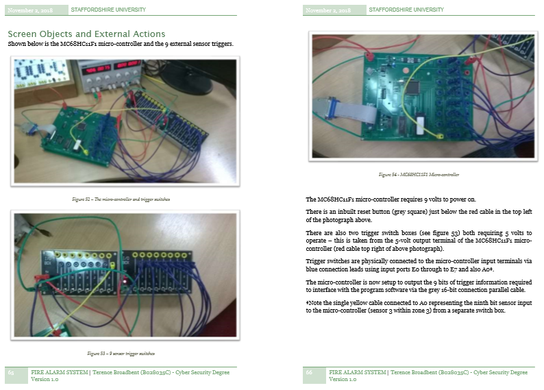
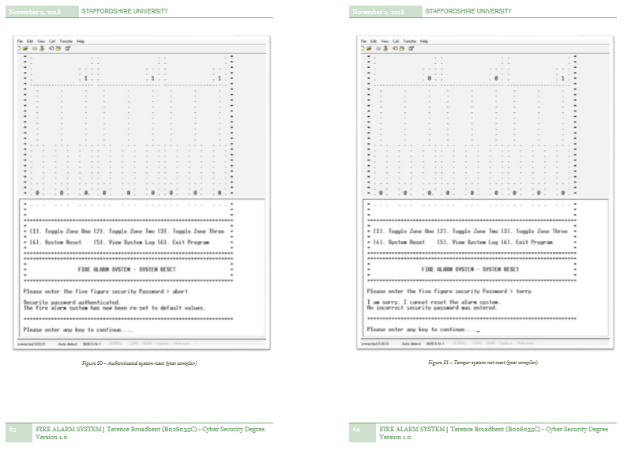

# FIRE ALARM SYSTEM

Use of Micro-controller MC68HC11F1 with ported Visual Studio C computer programming language to construct a sophisticated fire alarm system.

| LANGUAGE | FILENAME               | MD5 Hash                         |
|------    |------                  | -------                          |
| C        | FireAlarm.c            | 5854c04da76dc7067187b61aa36b65cf |
| Pdf      | Fire Alarm Project.pdf | 0dfdc182bf1e704ff4c4226a6f9e829d |

## Micro-controller MC68HC11F1

